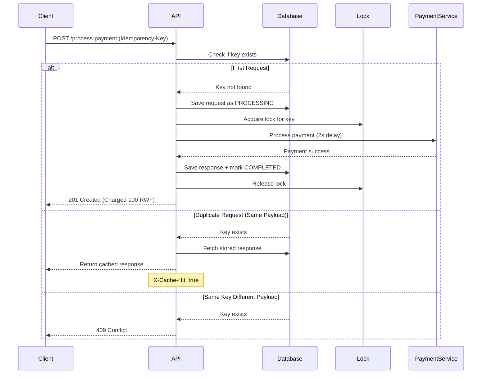

# Idempotency Gateway - IgirePay Technologies

A robust payment processing system with idempotency guarantees to prevent double-charging.

## Problem Statement

Payment processors face a critical challenge: network timeouts cause clients to retry requests, leading to double-charging. This system ensures that duplicate requests are safely handled, processing payments exactly once.

## Architecture Flowchart

```mermaid
flowchart TD

A[Client Sends POST /process-payment] --> B{Idempotency-Key Present?}

B -- No --> C[Return 400 Bad Request]

B -- Yes --> D{Check Key in Database}

D -- No --> E[Save Request Status = PROCESSING]
E --> F[Acquire Lock]
F --> G[Simulate Payment (2 seconds)]
G --> H[Save Response + Mark COMPLETED]
H --> I[Return 201 Created]

D -- Yes --> J{Same Request Body?}

J -- No --> K[Return 409 Conflict]

J -- Yes --> L[Return Cached Response]
L --> M[Add Header X-Cache-Hit: true]

```

---

## Sequence Diagram 


### Technology Stack

- **Backend**: Java 17, Spring Boot 3.2.0
- **Database**: PostgreSQL
- **Build Tool**: Maven
- **Key Libraries**: Spring Data JPA, Lombok, Jackson

## Setup Instructions

### Prerequisites

- Java 17 or higher
- PostgreSQL 12+
- Maven 3.6+

### Installation

1. **Clone the repository**
   ```bash
   git clone https://github.com/yourusername/idempotency-gateway.git
   cd idempotency-gateway
